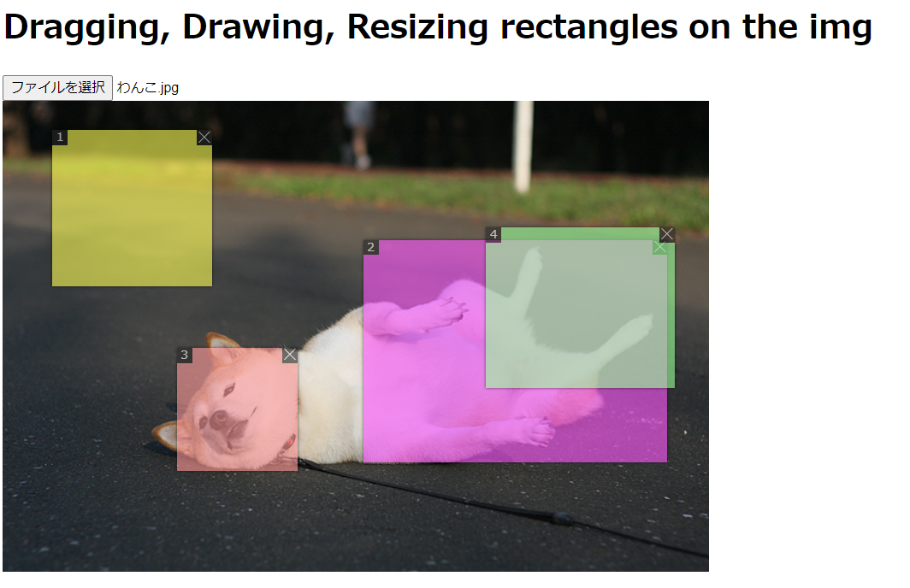

# React Multi Crops

A multiple cropping component for React

forked from https://beizhedenglong.github.io/react-multi-crops/ 　 [(online demo)](https://beizhedenglong.github.io/react-multi-crops/)




## Installation
```
npm install react-multi-crops@github:momomosu/react-multi-crops
 yarn add react-multi-crops@github:momomosu/react-multi-crops
```


## Usage

```js
import React, {useState} from 'react'
import ReactDOM from 'react-dom'
import MultiCrops from '../src/components/MultiCrops'
import sampleImg from './imgs/kumamon.jpg'

const samples = [
  { x: 178, y: 91, width: 158, height: 132, id: 'SJxb6YpuG', },
  { x: 436, y: 97, width: 170, height: 168, id: 'SJMZ6YTdf', },
];
const cropColors = ["#ff9999", "#99ff99", "#9999ff", "#ffff55", "#ff55ff"];

const App = () => {
  const [crops, setCrops] = useState(samples);
  const [image, setImage] = useState(sampleImg);

  const onChangeImage = (args) => {
    const file = args.target.files[0];
    setImage(URL.createObjectURL(file));
    console.log(file);
    console.log(args);
  }
  const changeCoordinate = (coordinate, index, _crops) => {
    setCrops(_crops);
  }
  const deleteCoordinate = (coordinate, index, _crops) => {
    setCrops(_crops);
  }
  const onClick = (coordinate, index) => {
    console.log("onClick", coordinate);
  }
  return (
      <div>
        <h1>Dragging, Drawing, Resizing rectangles on the img</h1>

        <input type="file" onChange={onChangeImage} />
        <MultiCrops
            src={image}
            coordinates={crops}
            // onDrag={this.changeCoordinate}
            // onResize={this.changeCoordinate}
            // onDraw={this.changeCoordinate}
            onClick={onClick}
            onChange={changeCoordinate}
            onDelete={deleteCoordinate}
            colors={cropColors}
            // onLoad={e => console.log(e.target.height, e.target.width)}
        />
      </div>
  )
}


ReactDOM.render(
    <div>
      <App />
    </div>,
    document.getElementById('root'),
)


```

## Props

| Prop        | Description                                                                                        | Type                                     | Default |
|-------------|----------------------------------------------------------------------------------------------------|------------------------------------------|---------|
| src         | Src of background image.                                                                           | string                                   | -       |
| coordinates | An array of coordinate( see the table below), {id, x, y, width, height, color}.                    | array                                    | []      |
| width       | Width of background image.                                                                         | number(in pixel)                         | -       |
| height      | Height of background image.                                                                        | number(in pixel)                         | -       |
| onDraw      | A callback which hanppends when a user starts drawing a new rectangle.                             | funtion(coordinate , index, coordinates) | -       |
| onDrag      | A callback which hanppends when  a user stars draging a exited rectangle.                          | funtion(coordinate , index, coordinates) | -       |
| onResize    | A callback which hanppends when a user starts resizing a exited rectangle.                         | funtion(coordinate , index, coordinates) | -       |
| onChange    | A callback which hanppends when a user starts drawing, draging or resizing a new/exited rectangle. | funtion(coordinate , index, coordinates) | -       |
| onDelete    | A callback which hanppends when a user delete a exited rectangle.                                  | funtion(coordinate , index, coordinates) | -       |
| onLoad      | The callback is  triggered when the background image is loaded.                                    | onLoad(e)                                | -       |
| onClick     | callback on crop clicked                                                                           | function(coordinate, index)              |
| colors      | array of crop colors                                                                               | array(string)                            |         |


### coordinate

| Prop   | Description                                                                                       | Type             | Default |
|--------|---------------------------------------------------------------------------------------------------|------------------|---------|
| id     | Unique in coordinates array                                                                       | string           | -       |
| x      | X coordinate  relative to left corner(0,0) of background image. From left to right, x will go up. | number(in pixel) | -       |
| y      | Y coordinate  relative to left corner(0,0) of background image. From top to bottom, y will go up. | number(in pixel) | -       |
| width  | Rect width                                                                                        | number(in pixel) | -       |
| height | Rect height                                                                                       | number(in pixel) | -       |
| color  | Color of rect                                                                                    | string           |         |

